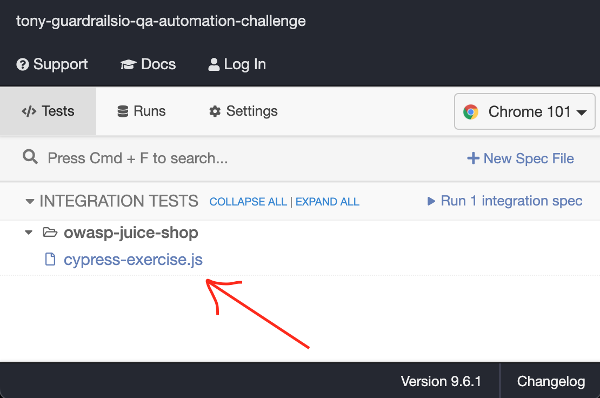
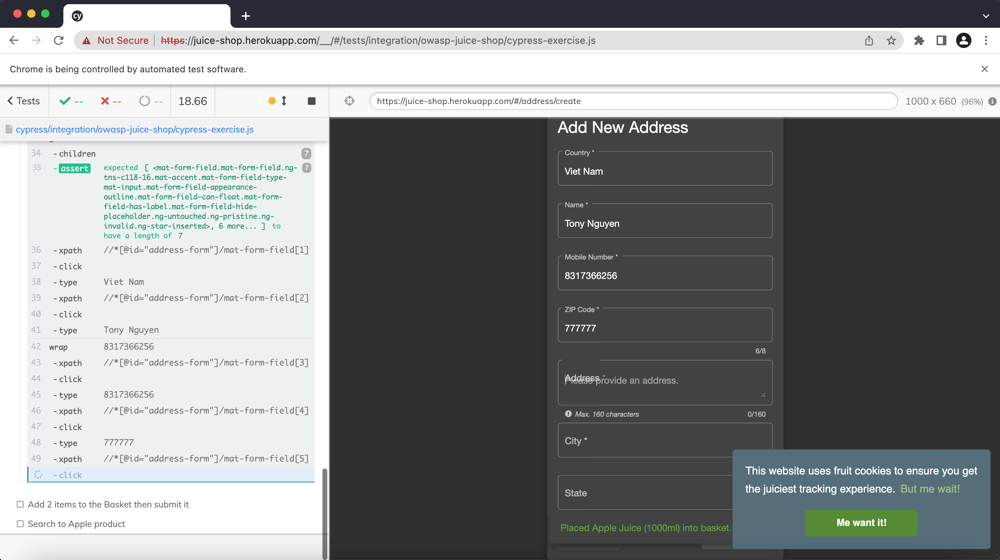

## guardrailsio-qa-automation-challenge

### Cypress Exercise
### For the Cypress exercise, you will help us testing the awesome OWASP Juice shop. You will have to test 3 different scenarios:
> Q1: Login with your user, add 1 item to the basket, click on checkout, add a new address, fill in the address form, click on submit.

> Q2: Exact same flow, but this time, add two items to your basket, click on checkout, add a new address, fill in the address form, click on submit.

> Q3: Click on the search button, search for apple, verify that 2 apple products show up and that banana product doesn't show up

#### Author: Tony Nguyen
#### Issue date: Sat 21 May, 2022

### To run this Cypress process:
1. Download and Install NodeJS: https://nodejs.org/en/download/
2. Download and install Visual Studio Code: https://code.visualstudio.com/download
    <sub> Note: Visual Studio Code is the most used IDE. However, you can use any IDE. </sub>


3. Get this code repo into your local machine and open the Cypress with this command:
```
node ./node_modules/cypress/bin/cypress open 
Or:
npx cypress open 
```
4. When the Cypress window opened, you can click on the test 'cypress-exercise.js' under 'integration/owasp-juice-shop' to run the test

    

5. The will exeute like this:
    


## Enjoy your testing time, pelase ping me if you have any questtion !!
